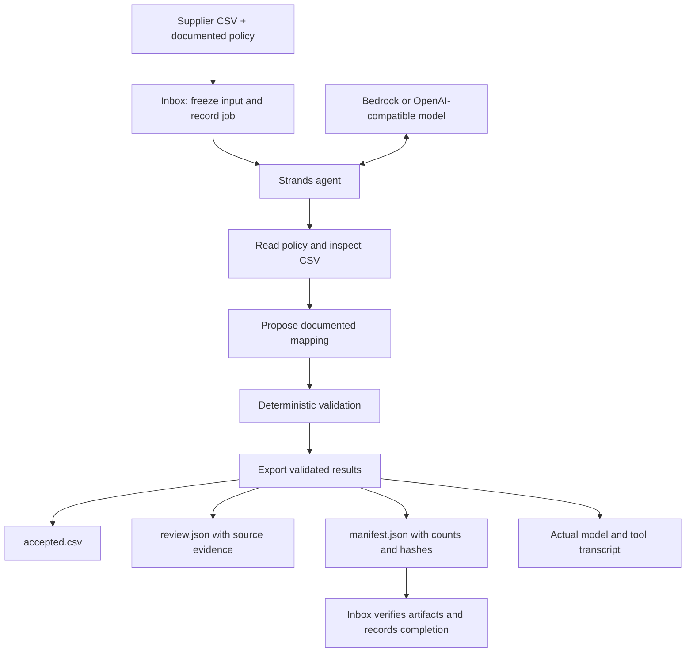

# Import Review architecture

The model chooses tool calls. The tools bind every operation to one immutable input, policy and output directory. They do not expose shell execution or arbitrary file reads. Policy controls header aliases and normalization; deterministic validation retains unknown or conflicting records for review. A model statement cannot mark an inbox job complete without verified output artifacts.

The inbox fingerprints input and policy before calling the agent. Completed content is skipped across restarts. Failed or interrupted content requires explicit retry. Operators deliver input with an atomic rename to `.csv`, so the reader does not consume a partially written file.

## Recorded integration

On September 8, 2026, Strands 1.54.0 with an OpenAI-compatible GLM gateway processed the synthetic example through `read_policy`, `inspect_csv`, `propose_mapping`, `validate_import`, and `export_result`. It exported SKU `001AB`, quantity `2`, price `1.2300`; the negative quantity and two conflicting SKU records remained in review. Counts reconciled: four input records, one accepted, three in review.

The saved example transcript in `examples/verified-run/` is evidence of that invocation. Runtime commands always make actual model requests; they do not replay the transcript. Core tests run without a model. Provider failure still prevents a successful agent job, and the observed AWS account did not pass its live inference test.

The production inbox CLI was also run against the same gateway and synthetic input. Its first run recorded a completed job after artifact verification; the second process exited successfully with no new event for the already processed content. The regression suite contains 20 passing tests, verified with Python 3.14.

This is a local prototype. It does not correct ambiguous records automatically or claim that validation rules establish business truth. Keep the source CSV and review queue for an operator's resolution.
